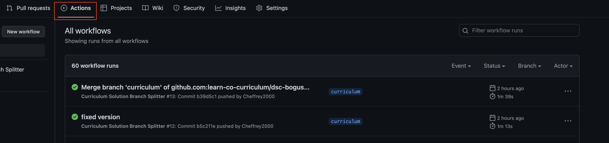

# Data Science Curriculum Maintenance Tools
> __Version 1.0.0__

## Curriculum Solution Branch Splitter
> Requires: __[run_branch_splitter.yml]__  
> Automatically runs the <a href='https://github.com/learn-co-curriculum/dsc-curriculum-guidelines/tree/master/master-solution-branch-splitter'>FIS Branch Splitter</a> script on the calling repository. The action is triggered by any push to the __curriculum__ branch. 

### Usage
Usage of this action requires the addition of the action file **run_branch_splitter.yml** found in the root folder of the __main__ branch in this repository. The file needs to be saved in the repository you intend the changes to be made to, and it must be stored in .github/workflows/ folder which you will need to create. You can either download and add the file and directory via CLI, or you can do it directly in the repository. 
* Once you have the file, you will need to add the version to the end of the path which is located after the _uses_ argument in the yml file.
    * For example, if the current version is __1.0.0__ the path should read _learn-co-curriculum/dsc-github-actions-files/.github/workflows/branch_split.yml@v1_
    * (The second and third digits are not necessary, as these are reserved for small updates and patches to be reverse compatible)

Once the file has been added to the repository, any changes to the __curriculum__ branch of the repository will automatically trigger the action and make the changes to the necessary branches as if you were running the branch_splitter on your local machine.

### Workflow
* Ensure the __run_branch_splitter.yml__ file has been added to the repository in the correct folder.  
* Edit the __uses__ path to the current version.
    * If you are working locally, push the changes to the remote repository
    * If you are editing directly in the repo online, save the changes and commit them to the repo
* Clone the repository to your local machine and make the necessary changes to the __curriculum__ branch.
* Push your changes to the remote repository

That's it!! Your changes have been made to the appropriate branches.  
You can watch the progress of the action and verify that it has run successfully by looking at the most recent _workflow run_ in the __actions__ tab of the github repository as in the image below:  

## Update Canvas

> Requires: __[update_canvas.yml]__ and the presence of a __.canvas__ file in the calling repository.  
> When triggered manually, the action will push updates to all canvas courses, where the lesson is used, by means of the _github-to-canvas_ gem. This is dependent on the presence of the __.canvas__ file. In the absence of the __.canvas__ file, one would need to be added or the update would need to be done on your local machine via the gem.

